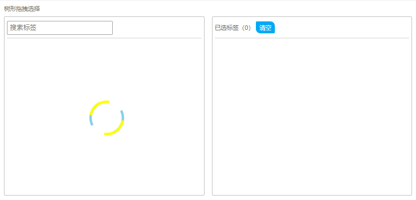
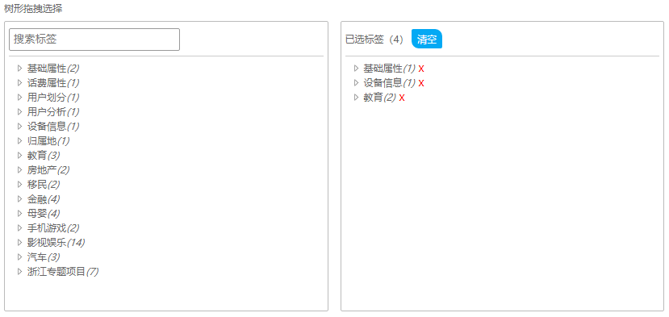

# 树形操作 demo

树形操作数据，做个整理总结。demo 是基于 jquery 及 easy-ui 库实现的。

## 树形选择
- [demo 预览](https://esnail.github.io/easy-ui-demo/tree-select.html)
- 实现功能点：
    - 树形展示
    - 左侧节点支持拖拽到右侧，并且重组为树形展示
    - 右侧已选树形节点支持删除，并统计选择的子节点个数
    - 支持默认有子节点数据
- 页面截图（vue、react）

